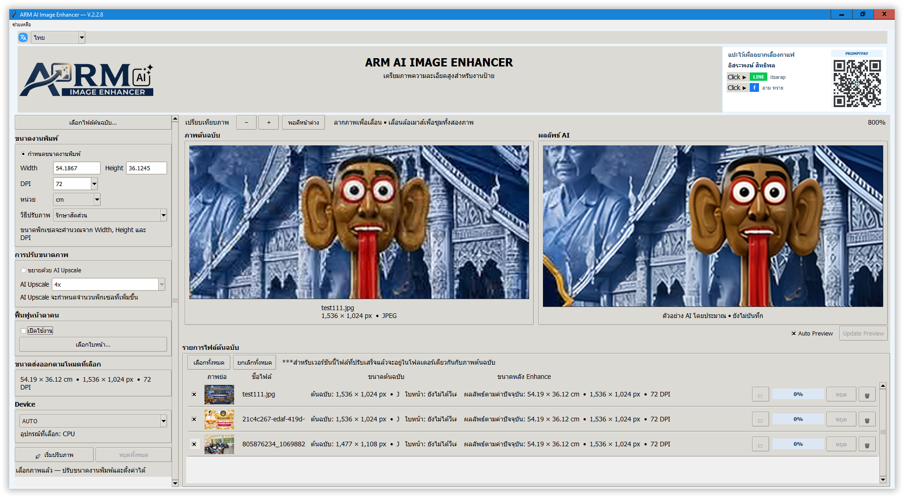
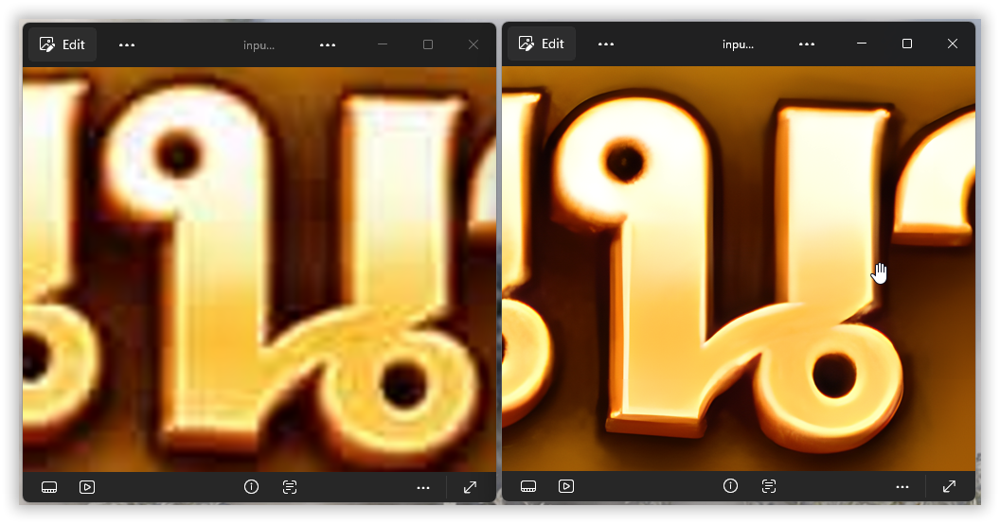
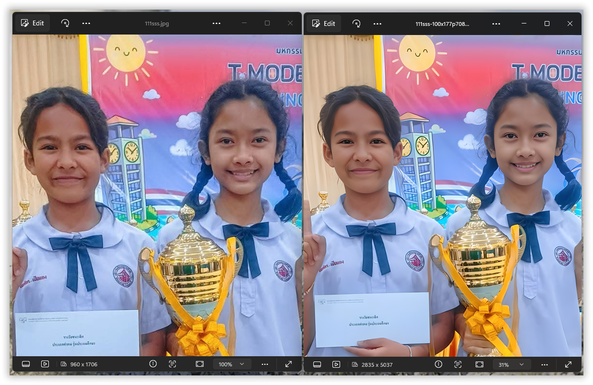
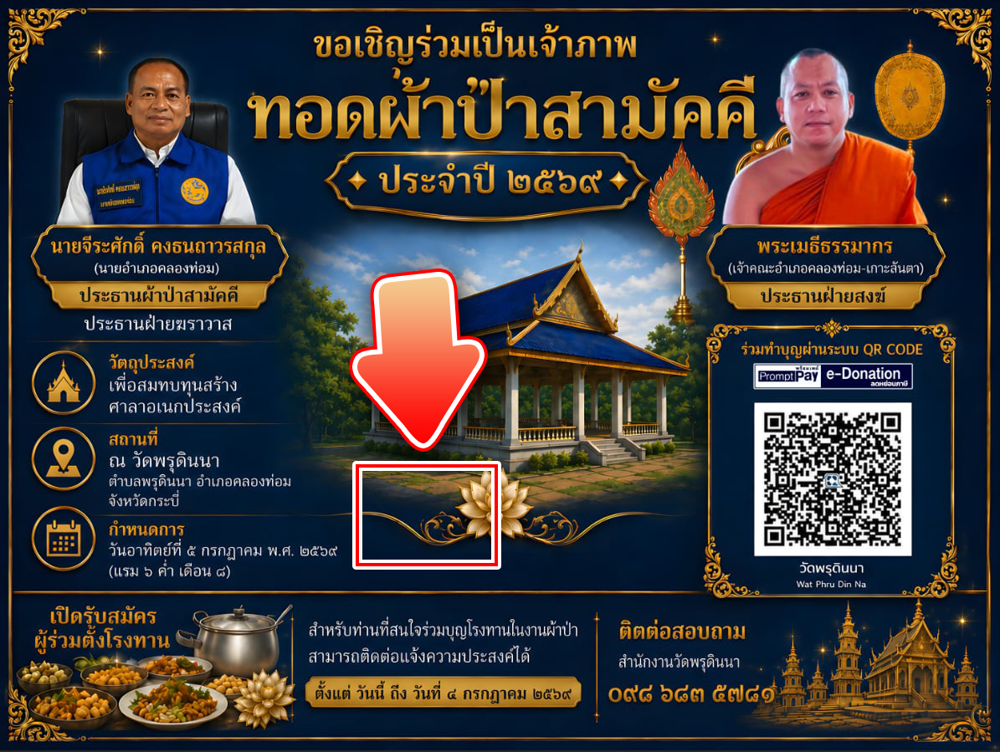
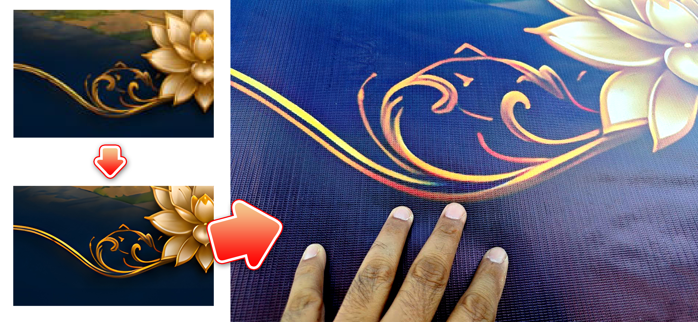
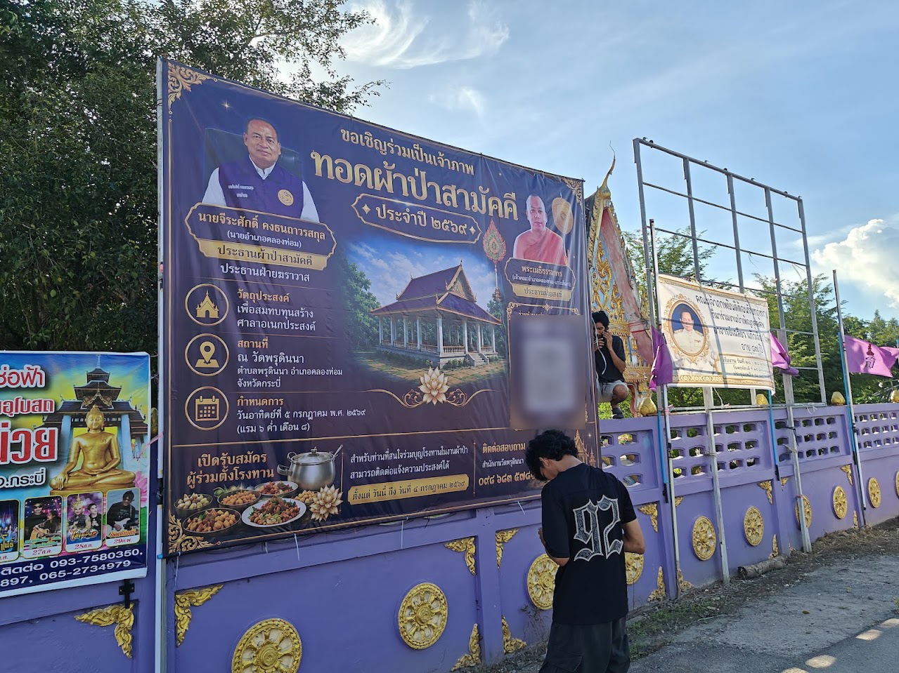

# ARM AI Image Enhancer V2.2.8

<p align="center">
  
</p>

<p align="center">
  <b>Free AI Image Upscaling & Print Preparation for Windows</b><br>
  Windows 10/11 64-bit · AI Upscaling · Custom Print Size & DPI · Face Recovery
</p>

ARM AI Image Enhancer is a Windows desktop application for enlarging images with AI and preparing them for real-world print production. Set a physical output size and DPI, compare image details in Live Preview, and prepare artwork for posters, signage, and large-format printing.

**V2.2.8 supports Windows 10 and Windows 11, 64-bit only.
Windows 7, Windows 8, Windows 8.1, and all 32-bit Windows versions are not supported.**

[Download V2.2.8](https://github.com/spnprint-ARM/arm-ai-image-enhancer/releases/tag/v2.2.8) · [Report an issue](https://github.com/spnprint-ARM/arm-ai-image-enhancer/issues)

## Program Overview

<p align="center">
  
</p>

## Features in V2.2.8

| Feature | What it helps you do |
| --- | --- |
| **AI Upscaling** | Enlarge images and enhance their apparent detail for higher-resolution output. |
| **Custom Physical Print Size & DPI** | Set width, height, and DPI using physical units such as centimetres, inches, and feet. Calculate the pixel dimensions needed for the intended print size. |
| **Live Preview** | Compare the original with an approximate AI result, zoom in, and inspect details before processing the final output. |
| **Face Recovery** | Optionally reconstruct facial details in low-resolution photographs. |
| **Device Selection** | Choose the processing device available on your system, or use AUTO. |
| **Print Production Workflow** | Connect image enhancement with physical dimensions and actual large-format output. |

### Understanding Print Size and DPI

Physical size and DPI determine the required pixel dimensions:

```text
Pixels = size in inches × DPI
Pixels = (size in centimetres ÷ 2.54) × DPI
Pixels = size in feet × 12 × DPI
```

For example, a 100 × 50 cm print at 150 DPI needs approximately **5,906 × 2,953 pixels**. Increasing DPI alone does not create image detail; AI enhancement helps prepare the image for enlargement. Choose the print resolution with your print provider based on the material and viewing distance.

## AI Enhancement — Before & After

<p align="center">
  
</p>

Compare edges, lettering, and texture when evaluating an enlarged image. The result depends on the source image and selected settings; inspect the final output at the intended print size.

## Face Recovery

<p align="center">
  
</p>

Enable Face Recovery when processing photographs that need facial detail reconstruction. AI-reconstructed details can differ from the original face, so review the finished image before production.

**In V2.2.8, Face Recovery is visible in the completed output, rather than in Live Preview.**

## Real-World Large-Format Printing

The following examples document the workflow from original artwork through enhanced detail to the actual printed material and final installation. Images are presented in their original filename order.

### 1. Original Artwork



### 2. Detail Enhancement → Printed Result



### 3. Close-up of the Actual Print



### 4. Final Large-Format Installation


> **Digital artwork → AI enhancement → print preparation → real-world large-format output.**

## System Requirements

| Operating system | V2.2.8 support |
| --- | --- |
| Windows 11 64-bit | Supported |
| Windows 10 64-bit | Supported |
| Windows 8 / 8.1 | Not supported |
| Windows 7 | Not supported |
| Windows 32-bit — any version | Not supported |

Processing time and memory use depend on the image dimensions, settings, and selected device. Larger print dimensions and higher DPI require more pixels and more processing resources.

## Download and Installation

**For Windows 10/11 64-bit only.**

Open the official [V2.2.8 release page](https://github.com/spnprint-ARM/arm-ai-image-enhancer/releases/tag/v2.2.8), expand **Assets**, and download all three files into the same folder:

1. `setup-V.2.2.8.exe`
2. `setup-V.2.2.8.dat.001`
3. `setup-V.2.2.8.dat.002`

Run `setup-V.2.2.8.exe`; do not open or extract the `.dat` files manually. The installer requests administrator privileges. The total download is approximately **3.78 GB**. After downloading, allow at least approximately **6.6 GB** of free space on drive C:, with additional temporary space potentially needed during installation.

The release also includes `README-V2.2.8.txt` and `SHA256-V2.2.8.txt` for installation guidance and file verification. Use the installer assets for normal installation; the **Source code** archives are intended for developers.

## Quick Start

1. Open the application and select your source image or images.
2. Choose a custom physical print size and DPI, or select AI Upscaling.
3. Select an available processing device, or use AUTO.
4. Compare the original and approximate result in Live Preview. Zoom in to inspect important details.
5. Enable Face Recovery if needed, then start processing.
6. Review the completed output, including any recovered faces, before sending it to print.

## Support and Feedback

Report problems or suggest improvements through [GitHub Issues](https://github.com/spnprint-ARM/arm-ai-image-enhancer/issues). Include the application version, Windows version and architecture, processing device, image dimensions, chosen settings, and the exact error message when available.

If you find the application useful, you can support the project by starring the repository and sharing your experience or print examples.

Third-party license and model information is available in **Help → Licenses and Third-Party Credits** and the notices bundled with V2.2.8. Refer to those notices for the terms applicable to each component.

## Roadmap — V3.0

- **Canvas Expansion — research / experimental:** under investigation for V3.0. Quality and reliability still require further work; it is not an advertised V2.2.8 feature, and no release date is promised.
- Further refinement of preview behavior, output-saving options, and installer information.

